# 📊 GEO 架构图与流程图 v1.0

> 用 Mermaid 绘制的可视化架构图,所有图都能在 GitHub/VSCode/Notion 中渲染。

---

## 1. GEO 完整架构图

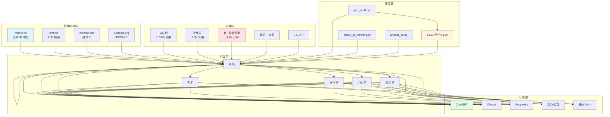

---

## 2. GEO 优化流程(从 0 到 100)

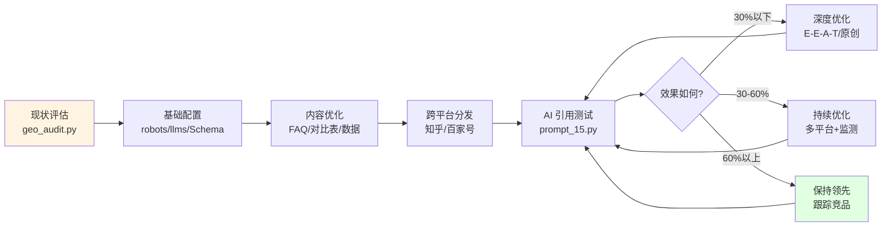

---

## 3. AI 引擎数据流向

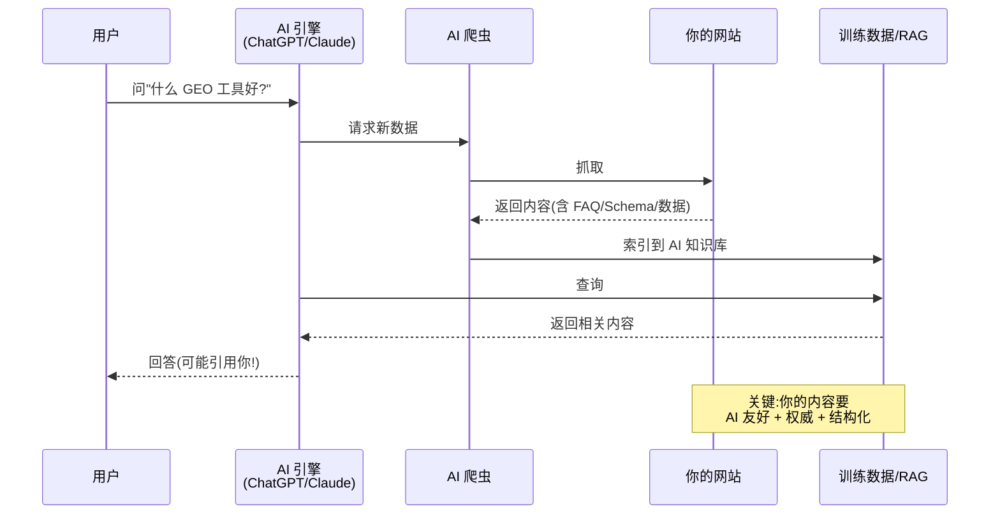

---

## 4. GEO vs SEO 决策树

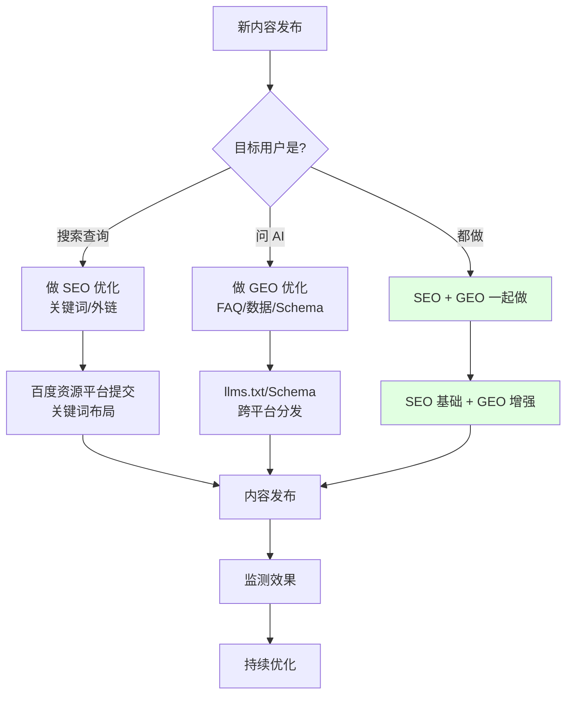

---

## 5. 故障排查流程

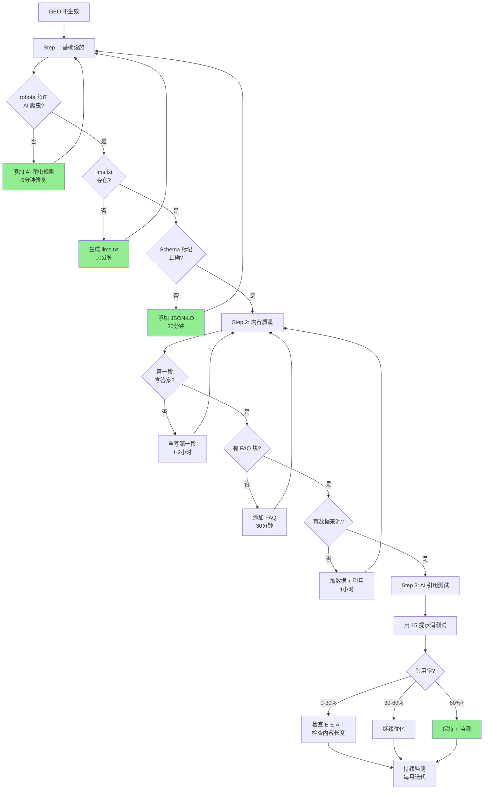

---

## 6. AI 爬虫生态

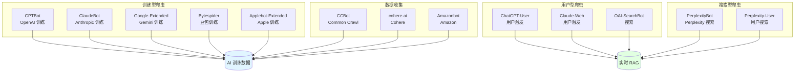

---

## 7. 30 天行动计划(可视化)

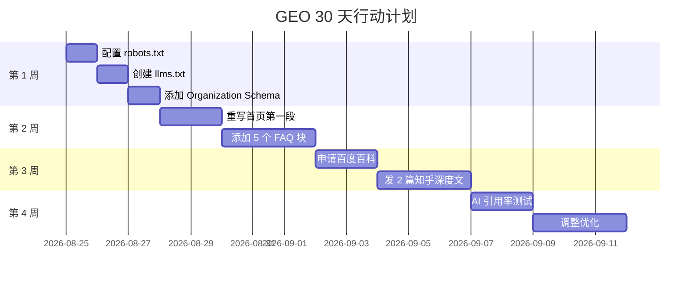

---

## 8. 多平台分发流程

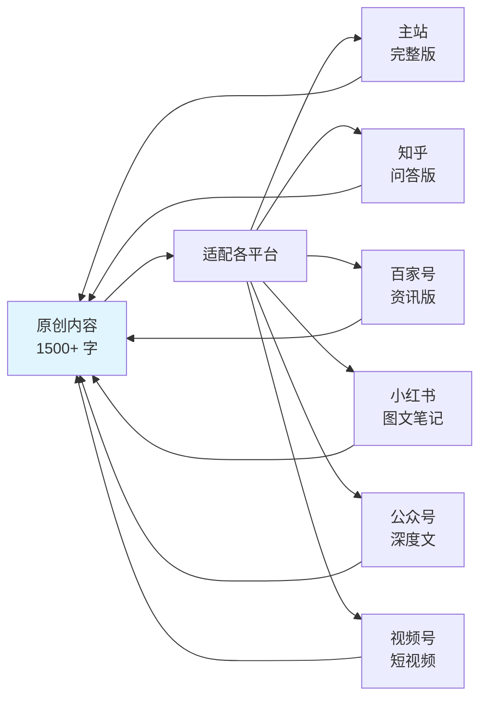

---

## 9. AI 引用决策树

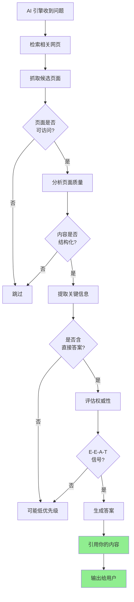

---

## 10. 评估矩阵

```mermaid
quadrantChart
    title GEO 评估四象限
    x-axis 低 GEO 引用率 --> 高 GEO 引用率
    y-axis 低 GEO 准备度 --> 高 GEO 准备度
    quadrant-1 明星(立即保持)
    quadrant-2 准备好但未被引用
    quadrant-3 急需改进
    quadrant-4 引流强但低质
    知识门户: [0.9, 0.9]
    知乎大V: [0.85, 0.7]
    普通博客: [0.3, 0.2]
    新站: [0.1, 0.1]
    高质量博客: [0.5, 0.8]
    内容农场: [0.7, 0.1]
```

---

## 11. 完整工作流(从新建站点到成熟)

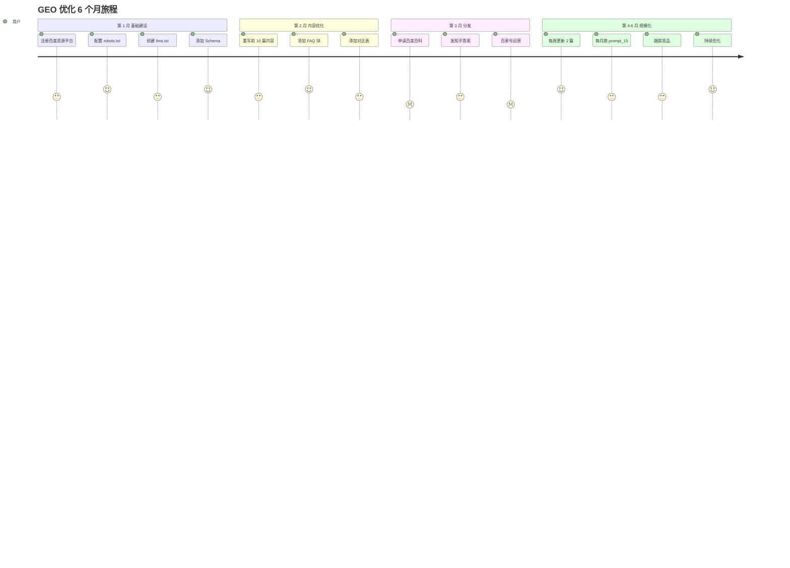

---

## 12. ROI 流向图

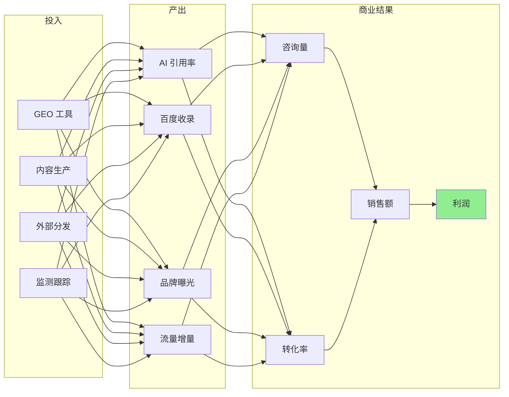

---

## 📚 怎么看这些图?

这些是 **Mermaid 格式**的图表,可以直接:

| 平台 | 支持? |
|---|---|
| **GitHub** | ✅ 自动渲染 |
| **GitLab** | ✅ 自动渲染 |
| **VSCode** | ✅ Markdown Preview Mermaid Support 插件 |
| **Notion** | ✅ /mermaid 块 |
| **Obsidian** | ✅ 自动渲染 |
| **Typora** | ✅ 付费版 |
| **VuePress** | ✅ 插件支持 |

**在 GitHub 上看**:
- 直接打开任意 .md 文件
- 图会显示在代码块里
- 点击代码块右上角的"view as diagram"可以全屏

---

**版本**:v1.0
**作者**:Hermes AI
**许可**:MIT
